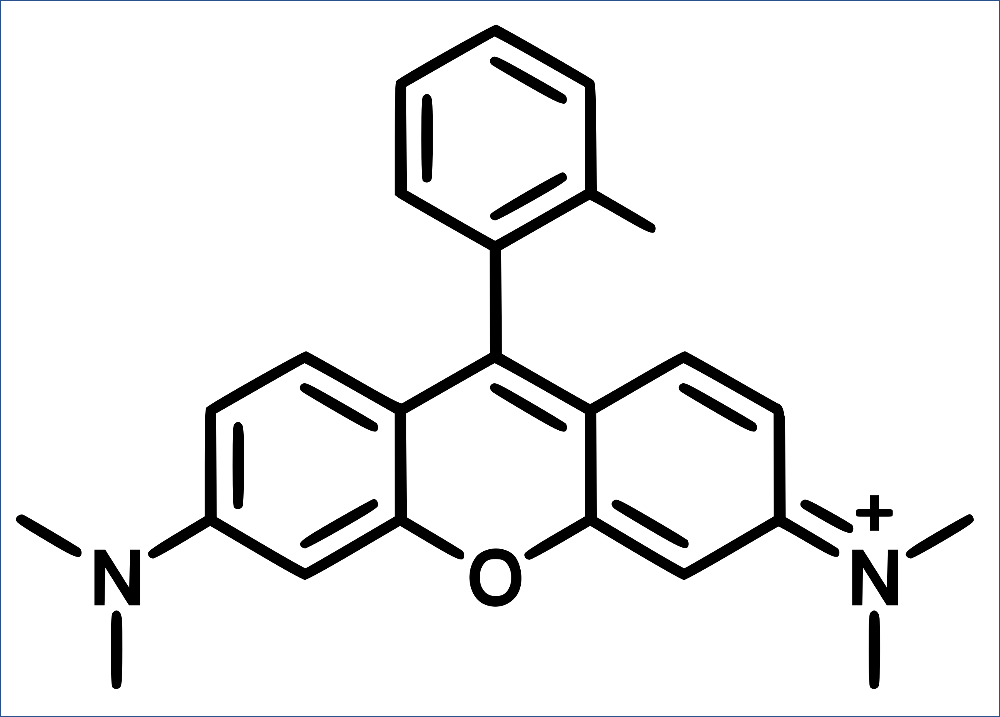

# Computational Supplementary Data

## Minimum geometries 

XYZ coordinate files for simplified Rhodamine B (Rhb-Me, see below) dye adopting different minima in two different electronic states.

### Ground-state (S0) geometries
The ground-state structures were optimized using MP2- (@MP2) or CAM-B3LYP/def2-SVP (@DFT) in gas phase.

- conformer 1 -3 (non twisted geometries)

### Excited-state geometries
The geometries in the first electronically excited singlet state (S1) were optimized for three distinct conformers (Rhb-Me0, Rhb-Me1 and Rhb-Me2) at TD-DFT 
(TD-CAM-B3LYP, @TD-DFT) or ADC(2) level (@ADC) of theory employing the def2-SVP basis set in gas phase.

#### ADC(2)

- locally excited state minima (
, 
, 

)
- twisted intramolecular charge transfer minima (
, 
, 

)

#### TD-DFT

- locally excited state minima (
, 
, 

)
- twisted intramolecular charge transfer minima (
, 
, 

)

## Relaxed Surface Scans

XYZ coordinates of relaxed potential energy surface scans of Rhb-Me1 and RhB-Me2 connecting the respective S1-LE and S1-TICT geometries
were obtained at TD-CAM-B3LYP/def2-SVP/SMD(Ethanol) level.

- 
- 

To account for density-dependent solvent polarization, the state-specific corrected linear response (cLR) formalism was applied in 
all TD-DFT calculations. 
Furthermore, energies for these geometries were computed at the ADC(2)/def2-SVP level of theory, including solvent effects of ethanol 
via the COSMO model. The full post-SCF scheme with perturbative state-specific corrections was employed to approximate a state-specific 
equilibrium for the S1 state.
The respective TD-DFT and ADC(2)-level energies are reported in the comment line of the scan geometries.

---

